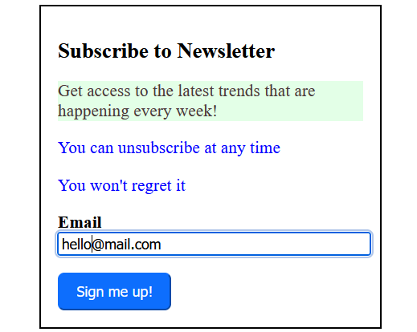

# Newsletter Subscription

## Screenshot



## Video (Frontend)

<https://www.youtube.com/watch?v=poNGgFmdGDQ>

<a href="https://www.youtube.com/watch?v=poNGgFmdGDQ">
  
</a>

## Video (Backend)

<https://www.youtube.com/watch?v=s89L0Cfvcos>

<a href="https://www.youtube.com/watch?v=s89L0Cfvcos">
  
</a>

## How to Run

### Backend

```sh
node server.js
```

### Frontend

Open `index.html` in a browser.
